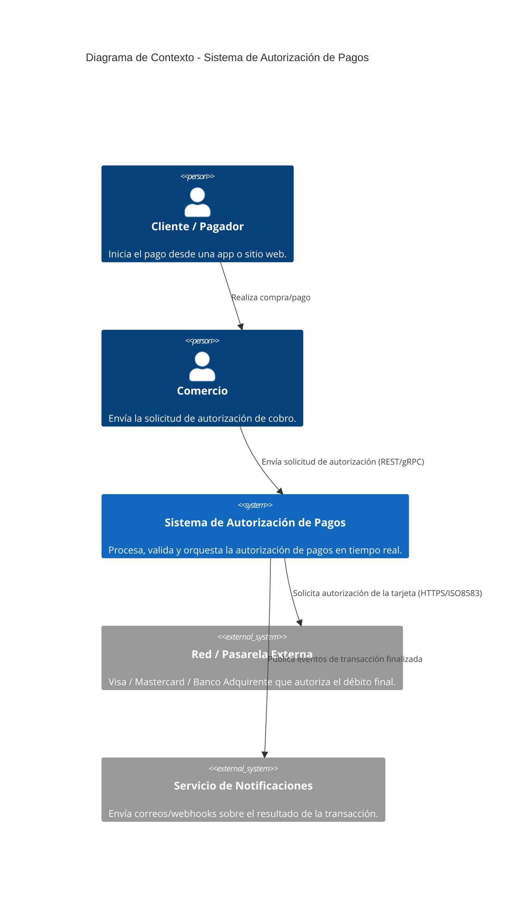
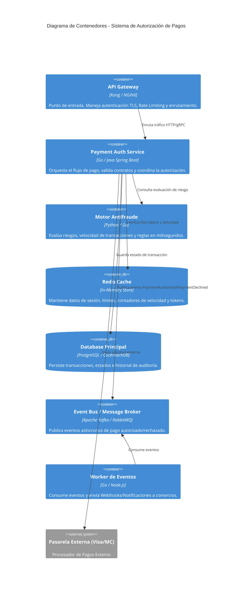
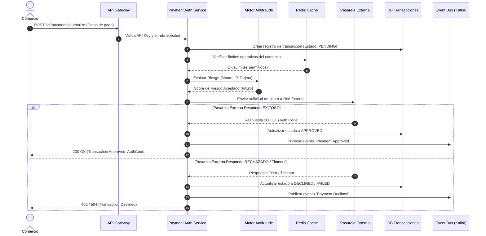

# Sistema de Autorización de Pagos

Documentación técnica y de arquitectura del proyecto de **Autorización de Pagos**, orientada a definir los componentes clave, decisiones de diseño, flujos operativos y estrategias de mitigación de riesgos.

---

## 1. Objetivo, Actores y Alcance

### Objetivo
Diseñar e implementar una plataforma centralizada de **Autorización de Pagos** capaz de procesar, validar, autorizar y monitorear transacciones financieras en tiempo real con alta disponibilidad, baja latencia y estrictos estándares de seguridad e integridad de datos.

### Actores
* **Cliente / Pagador:** Usuario final que inicia una transacción desde una aplicación móvil, web o punto de venta (POS).
* **Comercio (Merchant):** Entidad o negocio que solicita la cobranza/autorización a la plataforma.
* **Red de Procesamiento / Pasarela Externa:** Ente financiero externo (Visa, Mastercard, Banco Adquirente) encargado de validar los fondos y aprobar la transacción a nivel de red interbancaria.
* **Administrador del Sistema / Operador:** Personal interno con permisos para auditar transacciones, ajustar límites de fraude y gestionar comercios.

### Alcance
* **Dentro del Alcance:**
  * Recepción de solicitudes de pago en tiempo real vía API Rest/gRPC.
  * Autenticación, autorización de comercios y detección básica de fraude/reglas de negocio.
  * Orquestación de llamadas a pasarelas de pago y procesadores externos.
  * Persistencia auditada del estado de las transacciones (Aprobada, Rechazada, Pendiente, Cancelada).
  * Generación de eventos asíncronos para notificaciones y conciliación posterior.
* **Fuera del Alcance:**
  * Emisión física de tarjetas o plásticos financieros.
  * Conciliación bancaria manual o liquidación contable profunda en lote (batch de fin de día).
  * Gestión física de terminales POS.

---

## 2. Requisitos Funcionales y de Calidad

### Requisitos Funcionales (RF)
* **RF-01 (Procesamiento en Tiempo Real):** El sistema debe permitir la creación y autorización de solicitudes de pago de forma síncrona.
* **RF-02 (Validación de Reglas y Antifraude):** Debe aplicar validaciones de saldo, límites operativos, estado de cuenta del comercio y reglas anti-fraude previas al procesamiento externo.
* **RF-03 (Consulta de Estado):** Permitir a los comercios consultar el estado detallado de una transacción mediante un ID único (`transaction_id`).
* **RF-04 (Reversiones y Anulaciones):** Soportar solicitudes de reversión automática o manual para pagos que fallaron en etapas intermedias o fueron cancelados.
* **RF-05 (Auditoría e Historial):** Registrar cada cambio de estado de la transacción para análisis de auditoría sin opción a modificación posterior (Inmutabilidad).

### Requisitos de Calidad / No Funcionales (RNF)
* **RNF-01 (Disponibilidad):** La plataforma debe garantizar una disponibilidad del **99.95%** (Uptime mensual).
* **RNF-02 (Rendimiento y Latencia):** El tiempo de respuesta del motor interno de autorización no debe superar los **200 ms** (p99), excluyendo la latencia de las pasarelas externas.
* **RNF-03 (Seguridad):** Cumplimiento con estándares PCI-DSS (encapsulamiento/tokenización de datos sensibles de tarjeta) y comunicaciones cifradas mediante TLS 1.3.
* **RNF-04 (Escalabilidad Horizontal):** Capacidad para escalar dinámicamente ante picos de demanda (e.g., eventos comerciales masivos) procesando hasta **2,000 TPS** (Transacciones Por Segundo).
* **RNF-05 (Tolerancia a Fallos y Resiliencia):** Implementación de patrones de resiliencia (*Circuit Breaker*, *Retry con Jitter* y *Fallback*) para manejar la degradación de pasarelas externas.

---

## 3. Diagrama C4

### Nivel 1: Diagrama de Contexto

### Nivel 2: Diagrama de Contenedores

---

## 4. Flujo de una Operación Crítica: Autorización de Pago Síncrona

El siguiente diagrama de secuencia describe el recorrido de una transacción desde la recepción hasta su autorización final y notificación asíncrona:

---

## 5. Stack Propuesto con Justificación

| Componente | Tecnología Seleccionada | Justificación Técnica |
| :--- | :--- | :--- |
| **Lenguaje Backend Core** | **Go (Golang)** | Alta eficiencia en concurrencia (*goroutines*), bajo consumo de memoria y ejecución compilada ideal para bajas latencias (< 50ms). |
| **Base de Datos Relacional** | **PostgreSQL / CockroachDB** | Soporte para transacciones con cumplimiento estricto **ACID**, consistencia fuerte e integridad referencial imprescindible en datos financieros. |
| **Caché / In-Memory** | **Redis Cluster** | Lecturas e incrementos atómicos en submilisegundos para validación de *rate limiting*, límites operacionales y detección de duplicados (*idempotency keys*). |
| **Message Broker** | **Apache Kafka** | Alta capacidad de procesamiento (*throughput*), persistencia distribuida y modelo *pub/sub* para el manejo de eventos financieros e integración con microservicios asíncronos. |
| **API Gateway** | **Kong API Gateway** | Alto rendimiento basado en NGINX/Lua, soporte nativo para *Rate Limiting*, OAuth2, mTLS y fácil integrabilidad en Kubernetes. |
| **Infraestructura y Contenedores** | **Docker & Kubernetes (EKS/GKE)** | Orquestación robusta, despliegues sin tiempo de inactividad (*zero-downtime*), y autoescalado horizontal de pods (HPA) según tráfico real. |

---

## 6. Architecture Decision Records (ADR)

### ADR 001: Adopción del Patrón Outbox para Garantizar Consistencia Eventual
* **Estatus:** Aprobado
* **Contexto:** Al procesar un pago, la transacción se debe persistir en la base de datos relacional y, simultáneamente, publicar un evento en el Message Broker (Kafka) para notificaciones y análisis. Realizar esto de forma directa puede causar inconsistencias si la base de datos confirma el cambio pero la llamada al broker de eventos falla (o viceversa).
* **Decisión:** Implementar el patrón **Transactional Outbox Pattern**. El microservicio escribirá el evento en una tabla `outbox` dentro de la misma transacción de la base de datos. Un proceso independiente (*Debezium / CDC* o un *Poller*) leerá la tabla y garantizará la entrega al broker (Entrega *At-Least-Once*).
* **Consecuencias:**
  * **Positivas:** Evita la pérdida de eventos y garantiza consistencia fuerte entre la BD y los eventos publicados.
  * **Negativas:** Introduce una ligera latencia en la propagación de eventos asíncronos y requiere lógica de deduplicación en los consumidores.

### ADR 002: Elección de gRPC para Comunicación Inter-Servicios
* **Estatus:** Aprobado
* **Contexto:** Las llamadas síncronas entre el API Gateway, el Microservicio de Autorización y el Motor Antifraude consumen el 40% del tiempo de latencia total. REST/JSON añade overhead por serialización y parsing de cadenas de texto.
* **Decisión:** Adoptar **gRPC** con **Protocol Buffers (Protobuf)** para toda la comunicación síncrona interna entre microservicios.
* **Consecuencias:**
  * **Positivas:** Reducción drástica en tamaño de payload (formato binario), tiempos de serialización ultra rápidos y contratos estrictamente tipados.
  * **Negativas:** Menor legibilidad directa del tráfico en inspecciones HTTP convencionales; requiere herramientas específicas para depuración.

---

## 7. Riesgos y Mitigaciones

1. **Riesgo 1: Caída o Indisponibilidad de la Pasarela de Pago Externa**
   * *Impacto:* Alto. Bloqueo total del procesamiento de transacciones.
   * *Mitigación:* Implementación del patrón **Circuit Breaker** (usando librerías como Resilience4j/Gobreaker) combinado con **Failover Dinámico** hacia una pasarela secundaria o de respaldo si la tasa de errores de la principal supera el 15%.

2. **Riesgo 2: Ataques de Fuerza Bruta / Fraude de Pruebas de Tarjetas (Card Testing)**
   * *Impacto:* Medio/Alto. Saturación de recursos y altos costos por comisiones de procesamiento rechazado.
   * *Mitigación:* Aplicar un mecanismo estricto de **Rate Limiting** por IP/API Key en el API Gateway, validación de **CAPTCHA adaptativo** ante patrones sospechosos y reglas de velocidad en Redis (e.g., máximo 3 intentos fallidos con distintas tarjetas desde un mismo origen en 1 minuto).

3. **Riesgo 3: Inconsistencia o Duplicidad de Pagos por Reintentos de Red (Double Charging)**
   * *Impacto:* Crítico. Cobros dobles a clientes finales y reclamos legales/financieros.
   * *Mitigación:* Exigir una clave de idempotencia (**Idempotency-Key**) en todas las solicitudes POST de autorización. La clave se almacena en Redis con un bloqueo distribuido (*Redlock*) durante el procesamiento para garantizar que una misma transacción jamás se ejecute dos veces.

---

## 8. Métricas Clave (KPIs)

### Métrica de Negocio: Tasa de Aprobación de Transacciones (Authorization Approval Rate)
* **Definición:** Porcentaje de transacciones procesadas con éxito (`APPROVED`) respecto al total de intentos en un intervalo de tiempo.
* **Fórmula:** 
  $$\text{Approval Rate (\%)} = \left( \frac{\text{Transacciones Aprobadas}}{\text{Transacciones Totales Solicitadas}} \right) \times 100$$
* **Objetivo / SLA:** Mantener un valor promedio $\ge 92\%$. Caídas drásticas por debajo del $85\%$ activan alertas de negocio inmediatas (posible falla en pasarela o bloqueo masivo por reglas de fraude).

### Métrica Técnica: Latencia de Respuesta P99 (99th Percentile Latency)
* **Definición:** El tiempo máximo que tarda el sistema en procesar el 99% de las solicitudes de pago autorizadas síncronamente.
* **Unidad de Medida:** Milisegundos (ms).
* **Objetivo / SLA:** $P99 < 200 \text{ ms}$ a nivel interno. Permite asegurar la velocidad del servicio ante picos de demanda y detectar degradaciones en el motor de autorización sin verse alterado por anomalías aisladas.
